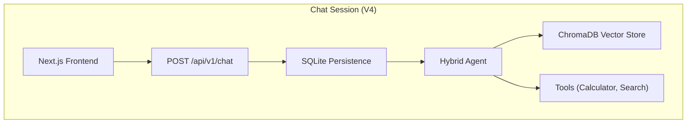

# 🏠 AI Real Estate Assistant

> AI-powered assistant for real estate agencies that helps buyers and renters find their ideal property.

[](https://python.org)
[](https://fastapi.tiangolo.com/)
[](https://nextjs.org/)
[](https://github.com/AleksNeStu/ai-real-estate-assistant/actions/workflows/ci.yml)
[](LICENSE)


> **Status**
> - **V4 (Active)**: FastAPI backend (`api/`) + Next.js frontend (`frontend/`)
> - **V3 (Frozen)**: Streamlit legacy code has been removed.

## 🌟 Overview

The AI Real Estate Assistant is a modern, conversational AI platform helping users find properties through natural language. Built with a **FastAPI** backend and **Next.js** frontend, it features semantic search, hybrid agent routing, and real-time analytics.

**[Docs](docs/)** | **[User Guide](docs/USER_GUIDE.md)** | **[Backend API](docs/API_REFERENCE.md)** | **[Developer Notes](docs/DEVELOPER_NOTES.md)** | **[Troubleshooting](docs/TROUBLESHOOTING.md)** | **[Testing](docs/TESTING_GUIDE.md)** | **[Contributing](docs/CONTRIBUTING.md)**

---

## ✨ Key Features

### 🤖 Multiple AI Model Providers
- **OpenAI**: GPT-4o, GPT-4o-mini, O1, O1-mini
- **Anthropic**: Claude 3.5 Sonnet, Claude 3.5 Haiku, Claude 3 Opus
- **Google**: Gemini 1.5 Pro, Gemini 1.5 Flash, Gemini 2.0 Flash
- **Grok (xAI)**: Grok 2, Grok 2 Vision
- **DeepSeek**: DeepSeek Chat, DeepSeek Coder, R1
- **Ollama**: Local models (Llama 3, Mistral, Qwen, Phi-3)

### 🧠 Intelligent Query Processing
- **Query Analyzer**: Automatically classifies intent and complexity
- **Hybrid Agent**: Routes queries to RAG or specialized tools
- **Smart Routing**: Simple queries → RAG (fast), Complex → Agent+Tools
- **Multi-Tool Support**: Mortgage calculator, property comparison, price analysis

### 🔍 Advanced Search & Retrieval
- **Persistent ChromaDB Vector Store**: Fast, persistent semantic search
- **Hybrid Retrieval**: Semantic + keyword search with MMR diversity
- **Result Reranking**: 30-40% improvement in relevance
- **Filter Extraction**: Automatic extraction of price, rooms, location, amenities

### 💎 Enhanced User Experience
- **Modern UI**: Next.js App Router with Tailwind CSS
- **Real-time**: Streaming responses from backend
- **Interactive**: Dynamic property cards and map views

---

## 🏗️ Architecture



---

## 🚀 Quick Start

### 🐳 Docker (Fastest Way)
The easiest way to run the full stack (Frontend + Backend + Database) locally.

```powershell
# 1. Prepare environment
Copy-Item .env.example .env
# Edit .env to add your API keys (e.g., OPENAI_API_KEY)

# 2. Run with Docker Compose
docker-compose up --build

# 3. Access
# Frontend: http://localhost:3000
# Backend API: http://localhost:8000/docs
```

### 🐍 Manual Setup

#### 1. Backend (FastAPI)

#### Windows (PowerShell)
```powershell
git clone https://github.com/AleksNeStu/ai-real-estate-assistant.git
cd ai-real-estate-assistant

# Install uv (fast Python package manager)
pip install uv

# Create virtual environment and install dependencies
uv venv .venv
.\.venv\Scripts\Activate.ps1
uv pip install -e .[dev]

Copy-Item .env.example .env
# Edit .env and set provider API keys and ENVIRONMENT
# Set ENVIRONMENT="local"

python -m uvicorn api.main:app --reload --host 0.0.0.0 --port 8000
```

#### macOS/Linux
```bash
git clone https://github.com/AleksNeStu/ai-real-estate-assistant.git
cd ai-real-estate-assistant

# Install uv (fast Python package manager)
pip install uv

# Create virtual environment and install dependencies
uv venv .venv
source .venv/bin/activate
uv pip install -e .[dev]

cp .env.example .env
# Edit .env and set provider API keys and ENVIRONMENT
# Set ENVIRONMENT="local"

python -m uvicorn api.main:app --reload --host 0.0.0.0 --port 8000
```

### 2. Frontend (Next.js)

```bash
cd frontend
npm install
npm run dev
```

Open `http://localhost:3000` (frontend). The backend runs at `http://localhost:8000`.

## 🧪 Testing

We use `pytest` for backend testing and `jest` for frontend testing.

```bash
# Backend Tests
python -m pytest tests/unit          # Unit tests
python -m pytest tests/integration   # Integration tests

# Frontend Tests
cd frontend
npm test
```

---

## 🚀 Deployment

### Quick Start

| Component | Platform | Status |
|-----------|----------|--------|
| Frontend | [Vercel](https://vercel.com) | Automated from GitHub |
| Backend | Render, Railway, Fly.io | Manual deployment |

### Environment Variables Matrix

| Environment | `NEXT_PUBLIC_API_URL` | `BACKEND_API_URL` |
|-------------|----------------------|-------------------|
| Local | `/api/v1` (uses Next.js proxy) | `http://localhost:8000/api/v1` |
| Production | `/api/v1` (uses Next.js proxy) | `https://your-backend.com/api/v1` |

### Key Security Design

- **API Access Key**: Set in Vercel dashboard (server-side only), never exposed to browser
- **API Proxy**: Frontend calls `/api/v1/*` which proxies to backend, injecting `X-API-Key` server-side
- **No Public Secrets**: `NEXT_PUBLIC_*` variables never contain sensitive data

**For complete deployment instructions**, see [DEPLOYMENT.md](DEPLOYMENT.md).

---

## 🧹 Maintenance

### Code Quality

The project uses `ruff` for Python linting and formatting.

```bash
python -m ruff check .
```

### Pre-Commit Hooks

This project includes a 3-layer pre-commit security system that runs automatically before each commit:

1. **Gitleaks** - Secret scanning (API keys, passwords, tokens)
2. **Semgrep** - SAST for Python security vulnerabilities (CI/CD only)
3. **Lint-staged** - Frontend code quality (Prettier + ESLint)

#### Installation

```bash
# After cloning, install the hooks
pre-commit install

# Install required tools
scoop install gitleaks  # Windows (or use choco)
pip install semgrep     # Optional: for local SAST
npm install             # For lint-staged and prettier
```

#### Running Hooks Manually

```bash
# Test all files
pre-commit run --all-files

# Run on staged files (automatic before commit)
git commit

# Skip temporarily if needed
git commit --no-verify
```

#### Configuration Files

- [`.gitleaks.toml`](.gitleaks.toml) - Secret detection rules
- [`semgrep.yml`](semgrep.yml) - Security scanning rules
- [`.pre-commit-config.yaml`](.pre-commit-config.yaml) - Hook configuration
- [`.prettierrc`](.prettierrc) - Code formatting config
- [`package.json`](package.json) - lint-staged configuration

### Local Security Scanning

For full CI/CD security parity, you can run all security checks locally:

```bash
# Run all security scans (Gitleaks, Semgrep, Bandit, pip-audit)
python security-scan.py

# Or use the direct path
python scripts/ci/security_local.py

# Run specific scan only
python security-scan.py --scan-only=secrets    # Gitleaks
python security-scan.py --scan-only=semgrep    # Semgrep SAST
python security-scan.py --scan-only=bandit     # Bandit Python security
python security-scan.py --scan-only=pip-audit  # Dependency vulnerabilities

# Quick mode (skip slower pip-audit scan)
python security-scan.py --quick

# Verbose output
python security-scan.py --verbose
```

**Docker Fallback:** On Windows, if Gitleaks or Semgrep binaries aren't installed, the script automatically uses Docker containers.

**Tool Installation:**

```bash
# Optional: Install tools locally for faster execution
scoop install gitleaks   # Windows (or brew install gitleaks on macOS)
pip install semgrep       # SAST scanning
pip install bandit        # Python security (already in dev dependencies)
pip install pip-audit     # Dependency auditing (already in dev dependencies)
```

---

## ⚙️ Configuration

Core configuration is controlled via environment variables and `.env`:

```bash
# Required (at least one provider)
OPENAI_API_KEY="<OPENAI_API_KEY>"
ANTHROPIC_API_KEY="<ANTHROPIC_API_KEY>"
GOOGLE_API_KEY="<GOOGLE_API_KEY>"

# Backend
ENVIRONMENT="local"
CORS_ALLOW_ORIGINS="http://localhost:3000"

# Optional
OLLAMA_BASE_URL="http://localhost:11434"
SMTP_USERNAME="..."
SMTP_PASSWORD="..."
SMTP_PROVIDER="sendgrid"
```

Frontend-specific variables (optional) go into `frontend/.env.local`.

---

## 🤖 Local Models (Ollama)

1. **Install Ollama**: [ollama.com](https://ollama.com)
2. **Pull Model**: `ollama pull llama3.3`
3. **Configure**: Set `OLLAMA_BASE_URL="http://localhost:11434"` in `.env`
4. **Select**: Choose "Ollama" in the frontend provider selector.

---

## 🧪 Development & Testing

- **Backend Tests**: `pytest`
- **Frontend Tests**: `cd frontend && npm test`
- **Linting**: `ruff check .` (Python), `npm run lint` (Frontend)

See `docs/TESTING_GUIDE.md` for details.

---

## 🚀 One-Command Start (Docker)

```powershell
# CPU
.\scripts\dev\run-docker-cpu.ps1

# GPU (if available)
.\scripts\dev\run-docker-gpu.ps1

# GPU + Internet web research (starts the `internet` compose profile)
.\scripts\dev\run-docker-gpu-internet.ps1
```

If you prefer a single entrypoint:

```powershell
.\scripts\dev\start.ps1 --mode docker --docker-mode auto
.\scripts\dev\start.ps1 --mode docker --docker-mode gpu --internet
```

---

## 🗄️ Optional Redis (MCP/Caching)

For MCP tooling or future caching/session features, a local Redis service is included in Docker Compose.

```powershell
# Start only Redis
docker compose up -d redis

# Or start all services (backend, frontend, redis)
docker compose up -d --build
```

Configure clients via:

```bash
REDIS_URL="redis://localhost:6379"
```

---

## 🤝 Contributing

Contributions are welcome. See [CONTRIBUTING.md](CONTRIBUTING.md) for the full workflow.

1. Fork the repository
2. Create a feature branch (`git checkout -b feature/short-description`)
3. Run checks locally
4. Commit using the format `type(scope): message [IP-XXX]`
5. Open a Pull Request against `main`

---

## 🔧 Troubleshooting

See `docs/TROUBLESHOOTING.md` for detailed help.

### Common Issues

**Port already in use (8000)**:
```powershell
netstat -ano | findstr :8000
taskkill /PID <PID> /F
```

**API Key not recognized**:
- Ensure `.env` file is in project root
- Restart the application after editing `.env`

---

## 📄 License

This project is licensed under the MIT License — see the [LICENSE](LICENSE) file for details.

---

## 👤 Author

**Alex Nesterovich**
- GitHub: [@AleksNeStu](https://github.com/AleksNeStu)
- Repository: [ai-real-estate-assistant](https://github.com/AleksNeStu/ai-real-estate-assistant)

---

## 🙏 Acknowledgments

- [LangChain](https://langchain.com) for the AI framework
- [FastAPI](https://fastapi.tiangolo.com) for the backend
- [Next.js](https://nextjs.org) for the frontend
- [OpenAI](https://openai.com), [Anthropic](https://anthropic.com), [Google](https://ai.google) for AI models
- [ChromaDB](https://www.trychroma.com) for vector storage

---

## 📞 Support

For questions or issues:
- Create an [Issue](https://github.com/AleksNeStu/ai-real-estate-assistant/issues)
- Check existing [Discussions](https://github.com/AleksNeStu/ai-real-estate-assistant/discussions)
- Review the [PRD](docs/PRD.MD) for detailed specifications

---

<div align="center">

**⭐ Star this repo if you find it helpful!**

Made with ❤️ using Python, FastAPI, and Next.js

Copyright © 2026 [Alex Nesterovich](https://github.com/AleksNeStu)

</div>
