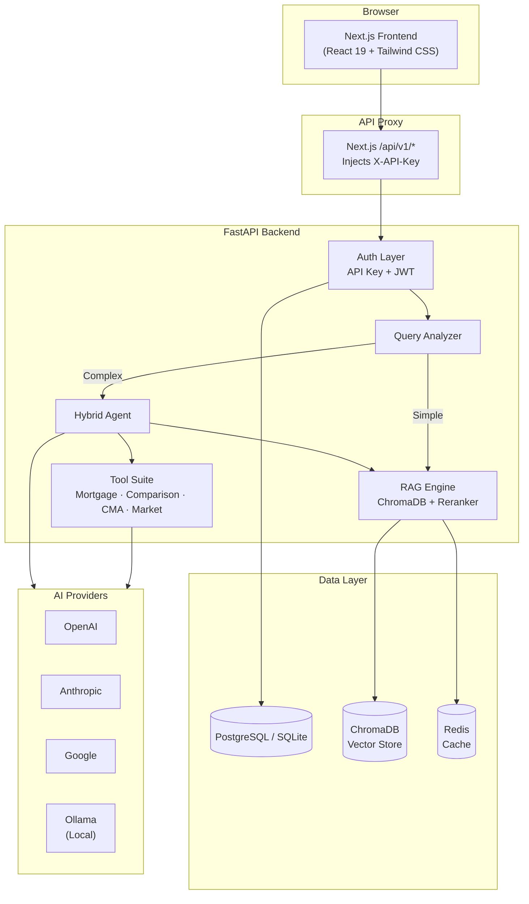

# Architecture

System architecture for AI Real Estate Assistant v4.0.

## High-Level Overview



## Request Flow

```
1. User types query in Next.js frontend
2. Request → /api/v1/* proxy (server-side, injects X-API-Key)
3. FastAPI authenticates (API Key or JWT)
4. Query Analyzer classifies complexity:
   - Simple → RAG-only (fast semantic search)
   - Medium → Hybrid (RAG + LLM enhancement)
   - Complex → Agent + Tools (mortgage calc, comparison, CMA)
5. Results stream back via SSE
6. Frontend renders property cards, map markers, or chat messages
```

## Component Details

### Frontend (apps/web/)

| Component | Technology | Purpose |
|-----------|-----------|---------|
| Pages | Next.js App Router | 15+ routes (search, chat, analytics, agents, CMA, etc.) |
| UI | React 19 + Tailwind CSS v4 | Responsive, dark/light mode |
| Maps | Mapbox GL / Leaflet | Interactive property maps with clustering |
| Charts | Recharts | Price history, market trends, ROI analysis |
| i18n | next-intl | 9 languages (EN, PL, RU, DE, ES, IT, PT, TR, UK) |
| Auth | Context + JWT | Login, register, profile, preferences |
| State | React Context | Favorites, saved searches, user session |
| PWA | Service Worker | Offline caching, installable app |

### Backend (apps/api/)

| Layer | Technology | Purpose |
|-------|-----------|---------|
| API | FastAPI | Async REST endpoints with OpenAPI docs |
| Auth | API Key + JWT | Dual-mode authentication |
| Agent | HybridAgent + LangChain | Query routing, tool orchestration |
| RAG | ChromaDB + MMR | Semantic search with diversity reranking |
| LLM | Multi-provider factory | OpenAI, Anthropic, Google, Grok, DeepSeek, Ollama |
| Tools | LangChain Tools | Mortgage, comparison, CMA, market analysis |
| Data | SQLAlchemy + Alembic | PostgreSQL (prod) / SQLite (dev) |
| Cache | Redis | Response caching for search/RAG |
| Monitoring | Prometheus + Sentry | Metrics, error tracking, APM |

### LLM Provider Cascade

```
1. User task-specific preference (DB)
2. User global preference (DB)
3. Request parameter override
4. System default per task type
5. Settings default (DEFAULT_PROVIDER)
6. Ollama fallback (if configured)
```

## Authentication Flow

```
┌──────────────────────────────────────────────────┐
│ API Key Mode (basic access)                      │
│ Browser → Next.js proxy → injects X-API-Key     │
│ → FastAPI validates against settings              │
├──────────────────────────────────────────────────┤
│ JWT Mode (user features)                         │
│ Browser → Login/Register → JWT token             │
│ → Authorization: Bearer <token>                  │
│ → Favorites, saved searches, market, leads       │
└──────────────────────────────────────────────────┘
```

## Data Flow

```
Property Data → ChromaDB Seed (60 Polish listings)
                → Vector embeddings (semantic search)
                → SQLite/PostgreSQL (structured data)

User Query → Query Analyzer → Extract filters
           → ChromaDB search → Rerank results
           → LLM enhancement → Stream response
```

## Deployment Architecture

```
┌─────────────────────────────────────────┐
│ Production                               │
│                                          │
│  Render ──→ Next.js Frontend (staging)      │
│  Render ──→ FastAPI + SQLite (staging)      │
│                                          │
│  AI Providers (external API)             │
│  - OpenAI, Anthropic, Google, etc.       │
└─────────────────────────────────────────┘

┌─────────────────────────────────────────┐
│ Docker Compose (local/preview)           │
│                                          │
│  web:3082 ──→ Next.js                    │
│  api:8082 ──→ FastAPI + SQLite           │
│  redis:6379 ──→ Cache                    │
│  ollama:11434 ──→ Local LLM (optional)   │
└─────────────────────────────────────────┘
```

## Security Layers

1. **Pre-commit**: Gitleaks (secrets) + Ruff (lint) + lint-staged (frontend)
2. **CI/CD**: Semgrep (SAST) + Bandit + pip-audit + Trivy (containers)
3. **Runtime**: Rate limiting + CORS + SSRF protection + audit logging
4. **Auth**: API Key (basic) + JWT (user features) + bcrypt password hashing
5. **Data**: Environment-based secrets, no hardcoded credentials, PII protection

## Testing Strategy

| Level | Count | Tools |
|-------|-------|-------|
| Backend Unit | 3000+ | pytest + mocks |
| Backend Integration | 25+ | pytest + in-memory SQLite |
| Backend E2E | 15+ | pytest + live server |
| Frontend Unit | 1000+ | Jest + React Testing Library |
| Accessibility | WCAG 2.1 AA | axe-core |
| Performance | p95 benchmarks | Locust |
| Security | 5 scanners | Gitleaks, Semgrep, Bandit, pip-audit, Trivy |
| Lighthouse | >=90 scores | LHCI |
